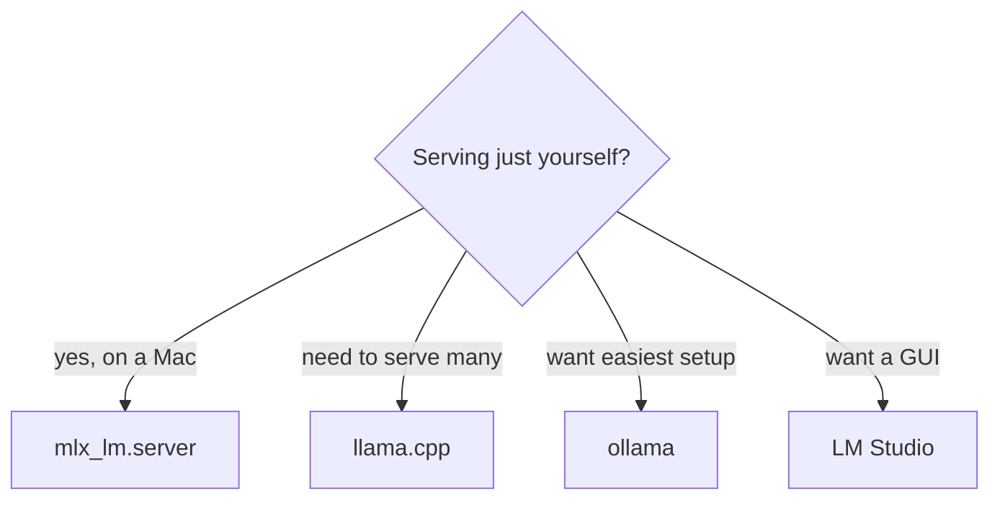
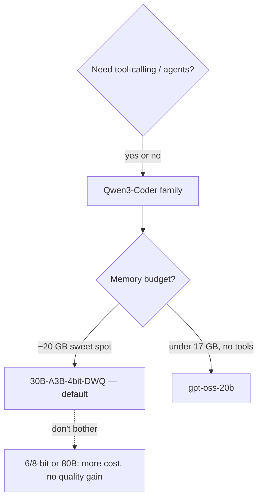

# Choosing your stack — pros, cons & a decision guide

A practical "pick X if…" guide derived from the [results](../FINDINGS.md).

> **Note:** these calls are for *this box* (Apple M4 Pro, 64 GB, single-user dev) and
> coding/agentic workloads. The reasoning transfers; the exact numbers won't.

## TL;DR — scenario → stack

| your situation | pick |
|---|---|
| **Daily agentic coding (best value)** | mlx_lm.server + Qwen3-Coder-30B-A3B-4bit-DWQ + **aider or goose** |
| **Maximum solve rate (cost no object)** | same engine/model, but **claude-code** (lands more tasks at 15–50× the cost) |
| **Lowest memory** | **gpt-oss-20b** (12–17 GB, no tools) or **DWQ-4bit** (20 GB); skip 6/8-bit + the 80B |
| **Multi-user / serving others** | **llama.cpp** (batches to 134 t/s vs MLX's flat 80), same DWQ model |
| **Tool-using agents** | **Qwen3-Coder family on mlx — only** |
| **RAG / embeddings** | **qwen3-embedding:0.6b** |

## Engine

| engine | pros | cons |
|---|---|---|
| **mlx_lm.server** | fastest single-stream, leanest memory, native Qwen3 tool-parsing, trivial setup | no throughput gain under load; Mac-only; one model per server (requesting another id silently swaps it); doesn't parse gpt-oss/Mistral tool formats |
| **llama.cpp** | best batching/throughput, runs everywhere, broadest model+quant support, `--jinja` parses many tool formats | ~25% slower single-stream than MLX; one tool_call per response; fiddlier flags |
| **ollama** | easiest UX, model registry, auto-manages | slower; batching off by default (`OLLAMA_NUM_PARALLEL`); long-context degraded vs MLX |
| **LM Studio** | nice GUI, runs MLX **and** GGUF, llama.cpp-class throughput | wrapper overhead, higher cold TTFT, GUI-centric |

## Model & quant

| model / quant | pros | cons | verdict |
|---|---|---|---|
| **30B-A3B-4bit-DWQ** | best HumanEval+ (0.93), tools ✓, 32k ✓, 90 t/s, 20 GB | — | **default pick** |
| 30B-A3B 6/8-bit | marginally different | 1.3–1.8× memory, ~half the speed, no quality gain | skip |
| 30B-A3B 4-bit (plain) | same speed/mem as DWQ | lower quality (0.86) + weaker tools | use DWQ instead |
| Coder-Next 80B | flagship | *lower* HE+ than DWQ-4bit, 2× memory, slower | not worth it |
| gpt-oss-20b | smallest (12–17 GB), codes well | tool-calling + long-context unusable via local serving | only if RAM-bound & no tools |
| dense (qwen2.5-32B, devstral-24B) | qwen2.5 codes very well | 5–13× slower (7–13 t/s) | too slow for interactive |

## Agent harness

| harness | pick if… | pros | cons |
|---|---|---|---|
| **aider** | you want efficient, scriptable edits | leanest tokens, fast, robust edit formats | one-shot; fewer hard-task solves |
| **goose** | efficient + lightly agentic | leanest + fastest, uses tools | lower solve rate on hard tasks |
| **claude-code** | you need the most solves & will pay | highest solve rate via iteration, great UX | 15–50× tokens/time; never self-terminates on a local model; needs the Anthropic→OpenAI shim |
| crush | you want an agentic alternative | capable | spirals to 100–300k tokens, timeouts |
| opencode | interactive daily use (the `lcld` driver) | solid interactively | heaviest (up to 700k tok/task) + flaky headless |

## Honest caveats

- Pass rates here are *low* (local 30B on hard polyglot) — these picks optimise
  **efficiency and reliability**, not the raw capability of a frontier cloud model.
- "Best for tools" = the Qwen3-Coder family specifically; don't assume another model's
  tool-calling works locally without testing it.
- Single-user vs multi-user flips the engine choice (MLX ↔ llama.cpp) — know which you are.
